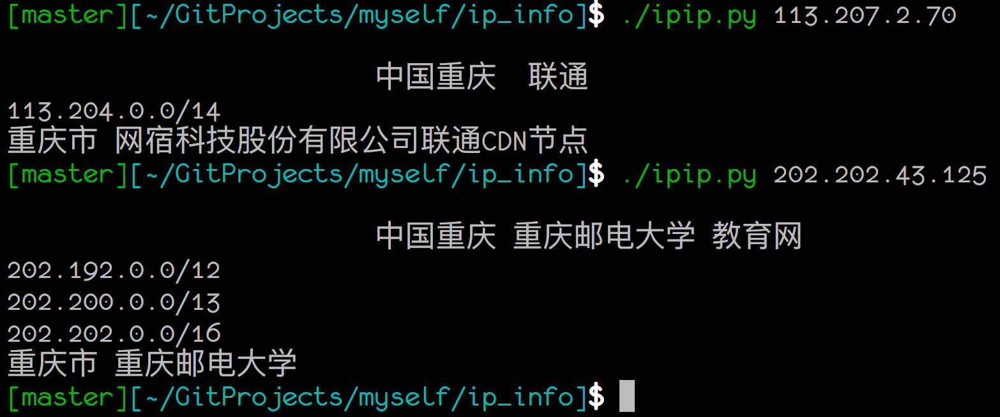

- ipip.py可以得到自己的IP，也可以传入一个ip作为参数查询
- ip138.py暂时只能传入参数查询，速度更快！
ip138.py 脚本来自
http://blog.csdn.net/tao_627/article/details/51019972
## Demo
```
➜  ip_info master ✓ ./ip138.py 202.202.43.125                                                 [22:31:30]
重庆市南岸区 重庆邮电大学 教育网
➜  ip_info master ✓ ./ipip.py 202.202.43.125                                                  [22:31:39]
中国重庆 重庆邮电大学 教育网
```

